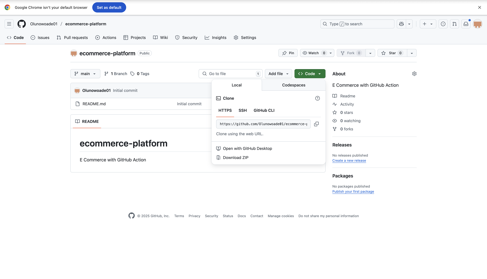

# ecommerce-platform
E Commerce with GitHub Action

# E-Commerce Platform with GitHub Actions, Docker, and Render

# Project Topic
# Automated CI/CD Pipeline for a Full-Stack E-Commerce Platform.

# Step 1: Create a New GitHub Repository

- I Created a new repository named `ecommerce-platform`.

# Step 2: Clone the Repository to Local Machine

- I Cloned the repository and opened it in Visual Studio Code.

# Step 3: Create Workflows Directory

- I Set up the `.github/workflows` directory for my GitHub Actions.

# Step 4: Create Project Structure

- I Created two main folders: `api` for the backend and `webapp` for the frontend.

# Step 5: Initialize Backend (API)

- I Changed to the `api` directory and initialized a Node.js/Express project.

# Step 6: Add Start Script to Backend

- I added a start script in `api/index.js` to launch the Express server.

# Step 7: Update Backend `package.json`

- i added the necessary scripts and dependencies in `api/package.json`.

# Step 8: Initialize Frontend (Webapp)

- I changed to the `webapp` directory and created a React app using `npx create-react-app`.

After installation completed 

# Step 9: Test Frontend Locally

- I tested the React app in the browser to confirm setup.

# Step 10: Set Up GitHub Actions CI Workflow

- i created a `ci.yml` file in `.github/workflows` to automate build and test for both backend and frontend.

# Step 11: Add Dockerfiles

- I created Dockerfiles for both backend (`api/Dockerfile`) and frontend (`webapp/Dockerfile`) to containerize the applications.

- Frontend Dockerfile `webapp/Dockerfile`

# Step 12: Build Docker Images

Built Docker images for both backend and frontend locally to ensure Dockerfiles work as expected.

- Backend: `docker build -t ecommerce-api ./api`
- Frontend: `docker build -t ecommerce-webapp ./webapp`

# Step 13: Deploy to Cloud (Render)

- I chose Render as the cloud platform for deployment. Pushed code to GitHub and connected the repo to Render for both backend and frontend services.

- Backend and frontend were deployed as separate services.
- Verified successful deployment for both.

**Backend deployed:**

**Frontend deployed:**

# Step 14: Connect Frontend to Backend

Updated `webapp/src/App.js` to fetch product data from the deployed backend API.

# Step 15: Verify Product List Display

- I tested the deployed frontend in the browser to confirm that the product list is fetched and displayed successfully.

# Project Summary

This project demonstrates how to build, containerize, and deploy a full-stack e-commerce application using modern DevOps practices. The backend is built with Node.js/Express, and the frontend uses React. CI/CD is implemented with GitHub Actions, and deployment is automated using Docker and Render. The project covers repository setup, workflow automation, Docker integration, and cloud deployment, providing hands-on experience with real-world DevOps tools and processes.

